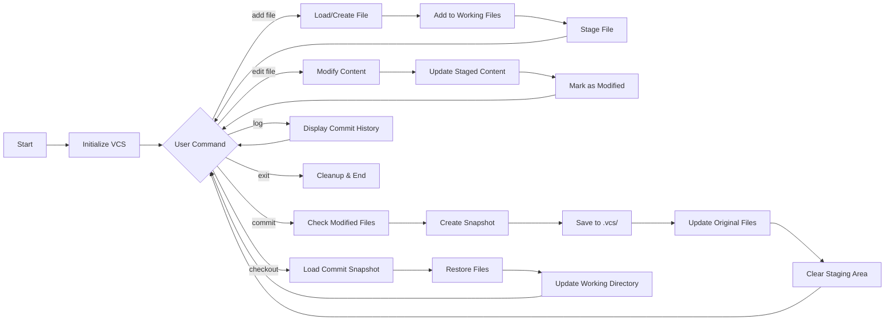

# VCSim: Mini Version Control System


A lightweight, Git-inspired version control system implementation in modern C++ demonstrating advanced OOP principles, design patterns, and system architecture concepts.

## 🚀 Overview

VCSim is a CLI-based version control system that provides core functionality similar to Git, including file staging, commit management, history tracking, and version checkout. Built as a learning project to demonstrate proficiency in C++ and software design patterns.

### Key Highlights
- **In-memory staging area** for tracking file modifications before commits
- **Snapshot-based versioning** with complete file state preservation
- **Persistent storage** with filesystem integration
- **Clean architecture** using SOLID principles and design patterns

## 📋 Features

### Core Functionality
- ✅ **File Management**: Add, edit, and track files
- ✅ **Staging Area**: Stage changes before committing
- ✅ **Commit System**: Save snapshots with descriptive messages
- ✅ **Version History**: View complete commit log with timestamps
- ✅ **Checkout**: Restore files to any previous commit state
- ✅ **Persistent Storage**: Automatic `.vcs` directory for metadata

### Technical Features
- 🔧 Object-oriented design with polymorphism and inheritance
- 🔧 Singleton pattern for repository management
- 🔧 Smart pointers for automatic memory management
- 🔧 Modern C++17 filesystem API integration
- 🔧 Template-based generic programming concepts

## 🏗️ System Architecture

### High-Level Architecture Diagram


### Class Hierarchy

```
File (Abstract Base)
├── TextFile
└── [Extensible for other file types]

Repository (Singleton)
├── Staged Files Management
├── Commit History
└── Filesystem Operations

Commit
├── Snapshot Storage
├── Metadata (ID, Message, Timestamp)
└── File Cloning

VCS (Controller)
├── Command Processing
├── Working Directory Management
└── User Interaction
```

## 🔄 System Flow

### Workflow Diagram



### State Management Flow


## 🛠️ Installation & Setup

### Prerequisites
- C++17 compatible compiler (GCC 8+, Clang 7+, MSVC 2017+)
- CMake 3.10+ (optional)
- Standard C++ library with filesystem support

### Building from Source

```bash
# Clone the repository
git clone https://github.com/shashidhar-N-18/VCSim.git
cd VCSim

# Compile the project
g++ -std=c++17 -o vcsim main.cpp -lstdc++fs

# Or using make (if Makefile provided)
make

# Run the application
./vcsim
```

## 📖 Usage Guide

### Basic Commands

| Command | Description | Example |
|---------|-------------|---------|
| `add <file>` | Add file to version control | `add README.md` |
| `edit <file>` | Modify file content | `edit main.cpp` |
| `commit <msg>` | Save current changes | `commit "Initial commit"` |
| `log` | View commit history | `log` |
| `checkout <id>` | Restore to specific commit | `checkout 1` |
| `exit` | Exit the application | `exit` |

### Example Workflow

```bash
>> add example.txt
File does not exist on disk. Create new? (y/n): y
File created.
Do you want to edit now? (y/n): y
Enter new content for example.txt: Hello, VCSim!
example.txt updated in memory (not saved to disk).
Note: Changes are staged. Use 'commit <msg>' to save these changes permanently.

>> commit "Added example file"
Commit done! Changes saved to .vcs and original files updated.

>> log
Commit 1: Added example file at Mon Mar 25 10:30:45 2025
[TextFile] example.txt: Hello, VCSim!
--------------------

>> edit example.txt
Enter new content for example.txt: Updated content!
example.txt updated in memory (not saved to disk).

>> commit "Updated example"
Commit done! Changes saved to .vcs and original files updated.

>> checkout 1
Checked out commit 1, files restored on disk.
```

## 🎯 Design Patterns & Principles

### Implemented Design Patterns

1. **Singleton Pattern**
   - Repository class ensures single instance for centralized state management
   - Thread-safe implementation using static local variable

2. **Prototype Pattern**
   - `clone()` method for creating deep copies of file objects
   - Enables snapshot creation without knowing concrete types

3. **Template Method Pattern**
   - Abstract `File` class defines interface for concrete implementations
   - Virtual methods for polymorphic behavior

4. **Command Pattern (Implicit)**
   - Command string parsing and execution in VCS controller
   - Extensible command processing architecture

### SOLID Principles Applied

- **Single Responsibility**: Each class has one clear purpose
- **Open/Closed**: Extensible for new file types without modifying existing code
- **Liskov Substitution**: Derived file types are substitutable for base `File`
- **Interface Segregation**: Clean, minimal interfaces
- **Dependency Inversion**: Depends on abstractions (File*) not concrete types

## 🔬 Technical Implementation Details

### Memory Management
- Smart pointers (`unique_ptr`) for automatic resource management
- RAII principles for file and directory operations
- No manual memory management required

### File System Integration
- C++17 `std::filesystem` for cross-platform compatibility
- Automatic `.vcs/` directory creation and management
- Persistent storage of commit snapshots

### Data Structures
- `std::vector` for dynamic file and commit collections
- `std::map` for efficient file lookup in commits
- String-based content management with staging support

## 🚧 Known Limitations & Future Enhancements

### Current Limitations
- Single-branch support only
- No merge capabilities
- Linear history only
- Basic text file support

### Planned Enhancements
- [ ] Branch management and merging
- [ ] Diff visualization
- [ ] Binary file support
- [ ] Compression for storage optimization
- [ ] Network synchronization
- [ ] GUI interface option

## 🧪 Testing

Run basic functionality tests:

```bash
# Compile with debug symbols
g++ -std=c++17 -g -o vcsim main.cpp -lstdc++fs

# Run with sample test cases
./vcsim < test_commands.txt
```

## 📊 Performance Characteristics

- **Time Complexity**:
  - Add/Edit: O(1) amortized
  - Commit: O(n) where n = modified files
  - Checkout: O(m) where m = files in commit
  - Log: O(c*f) where c = commits, f = files per commit

- **Space Complexity**:
  - O(c*f*s) where s = average file size

## 🤝 Contributing

Contributions are welcome! Please feel free to submit pull requests or open issues for bugs and feature requests.

### Development Setup
1. Fork the repository
2. Create your feature branch (`git checkout -b feature/AmazingFeature`)
3. Commit your changes (`git commit -m 'Add some AmazingFeature'`)
4. Push to the branch (`git push origin feature/AmazingFeature`)
5. Open a Pull Request

## 📄 License

This project is licensed under the MIT License - see the [LICENSE](LICENSE) file for details.

## 👤 Author

**Shashidhar N**
- GitHub: [@shashidhar-N-18](https://github.com/shashidhar-N-18)
- Project Link: [https://github.com/shashidhar-N-18/VCSim](https://github.com/shashidhar-N-18/VCSim)

## 🙏 Acknowledgments

- Inspired by Git's architecture and design principles
- Built as a learning project to demonstrate C++ proficiency
- Thanks to the C++ community for excellent documentation and resources

---

**Note**: This is an educational project demonstrating software engineering concepts and C++ programming skills. For production use, consider established version control systems like Git.

## 📈 Project Statistics

- **Language**: C++ (100%)
- **Lines of Code**: ~300
- **Design Patterns**: 4+
- **C++ Standard**: C++17
- **Dependencies**: STL only

---

